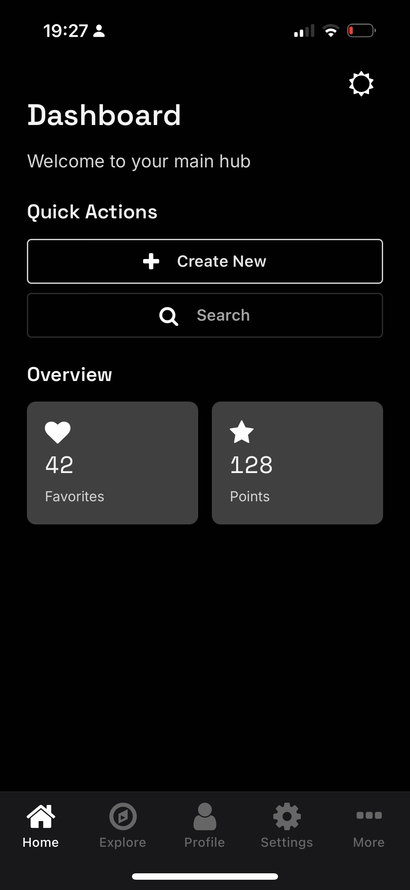
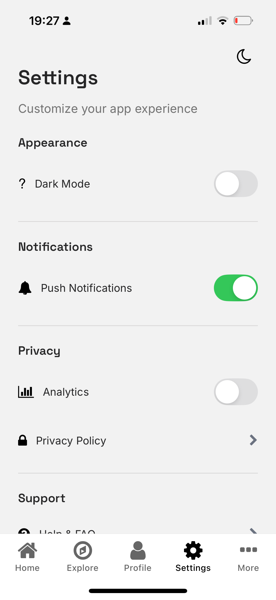

# Expo Glue

A modern React Native demo app showcasing cross-platform mobile development with Expo, Gluestack UI v3, and contemporary tooling.

## Screenshots

<div align="center">
  
  
</div>

*Light mode settings screen and dark mode home screen showcasing the adaptive theme system

## Tech Stack

- **[Expo](https://expo.dev)** - React Native framework with Expo Router for file-based navigation
- **[Gluestack UI v3](https://gluestack.io/)** - Modern *shadcn-like* component library with copy-paste architecture
- **[NativeWind](https://www.nativewind.dev/)** - Tailwind CSS for React Native
- **[TypeScript](https://www.typescriptlang.org/)** - Type safety and enhanced developer experience

## Features

### Core Functionality
- **Dark/Light Mode** - System-aware theme switching with persistent preferences
- **Tab Navigation** - Bottom tab interface with custom menu interactions
- **FAQ Section** - Collapsible content sections with smooth animations
- **Responsive Design** - Optimized layouts for various screen sizes

### Developer Experience
- **Modular Architecture** - Reusable components with clear separation of concerns
- **Custom Hooks** - Theme management and font loading abstractions
- **Icon System** - Theme-aware FontAwesome integration with consistent variants
- **Type Safety** - Full TypeScript coverage with proper component typing

### UI/UX
- **Google Fonts Integration** - Professional typography with multiple font families
- **Tailwind Styling** - Utility-first CSS with NativeWind compilation
- **Smooth Animations** - CSS transitions and transform animations
- **Accessible Components** - ARIA compliance and keyboard navigation support

## Project Structure

```
app/
├── (tabs)/                 # Tab navigator screens
│   ├── _layout.tsx         # Tab configuration
│   ├── index.tsx           # Home/Dashboard
│   ├── explore.tsx         # Discovery features
│   ├── profile.tsx         # User profile
│   ├── settings.tsx        # App preferences
│   └── more.tsx            # Additional options
├── _layout.tsx             # Root layout with providers
├── index.tsx               # Welcome splash screen
└── learn-more.tsx          # FAQ and documentation

components/
├── ui/                     # Gluestack UI components
├── icon.tsx                # Custom icon wrapper
├── theme-toggle.tsx        # Dark mode toggle
└── back-button.tsx         # Navigation helper

hooks/
├── use-theme.ts            # Theme state management
└── use-custom-fonts.ts     # Font loading logic
```

## Getting Started

### Prerequisites
- Node.js 18+ 
- Expo CLI
- iOS Simulator or Android Emulator (optional)

### Tested Platforms
- **iOS** - Fully tested and optimized
- **Android** - Compatible via Expo Go
- **Web** - Basic compatibility for development

### Installation

```bash
# Clone the repository
git clone https://github.com/mhurhangee/expo-glue.git
cd expo-glue

# Install dependencies
npm install

# Start development server
npx expo start
```

### Development Options
- See Expo's guide for how to set up development environment - https://docs.expo.dev/get-started/set-up-your-environment - for options such as on device, emulator/simulaor, and Expo Go.

## Key Implementation Details

### Theme System
The app uses a context-based theme system that automatically adapts components to light/dark modes:

```tsx
const { isDarkMode, toggleDarkMode } = useTheme();
```

### Component Architecture
Components follow Gluestack v3 patterns with Tailwind styling:

```tsx
<Button variant="solid" action="primary">
  <Icon name="rocket" size={16} variant="inverse" />
  <ButtonText>Get Started</ButtonText>
</Button>
```

### Font Loading
Custom Google Fonts are loaded via Expo Font with proper fallbacks:

```tsx
const [loaded] = useFonts({
  Inter_400Regular,
  SpaceGrotesk_600SemiBold,
  SpaceMono_400Regular,
});
```

## Customization

### Adding New Tabs
Create a new file in `app/tabs/` and add the screen configuration to `_layout.tsx`.

### Theme Colors
Modify `tailwind.config.js` and the theme context to adjust the color palette.

### Components
Add new Gluestack UI components with:
```bash
npx gluestack-ui add [component-name]
```

## Contributing

This project demonstrates modern React Native patterns and welcomes contributions that showcase additional best practices or improvements to the developer experience.

## License

MIT License - see LICENSE file for details.